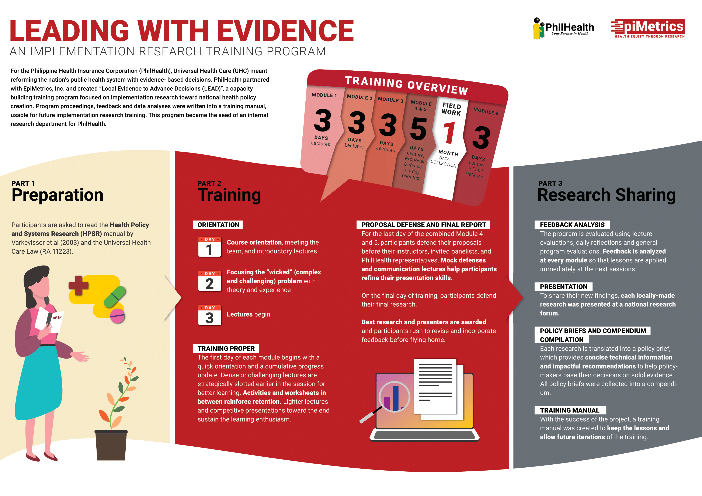

## A. Introduction

The Philippine Health Insurance Corporation (PhilHealth) in partnership with EpiMetrics, Inc. implemented the, “Local Evidence to Advance Decision (LEAD): A Capacity Building Program on Implementation Research for Phil Health Regional Officers”. The program trained 38 nominated regional and central PHIC planning officers representing each region of the Philippines in implementation research over 6 months. This began April- September 2019  Each module was designed to deliver implementation research content in 3 days through lectures, group learning activities and facilitated writing. Out of the program, 5 research papers with policy briefs were compiled into a compendium while feedback and module prework were written into a training manual.

## B. Methods
### I. Preparation

Before each module, participants were given readings (with the occasional pre-work) to ready them for the sessions. Initially, participants were asked to read the Health Policy and Systems Research (HPSR) manual by Varkevisser et al (2003) and the Universal Health Care Law (RA 11223). Curated readings were given before each of the modules.

### II. Training Orientation

#### Day 1 - Introduction to HSPR and to the team

Day 1 started with the course orientation and group dynamics to allow the participants to get to know each other and build camaraderie before the lectures start. Lectures on this day introduced health policy and systems research and methods, and evaluation. By the end of the day, participants chose a department of interest (e.g. HR, IT) to identify a “wicked” (complex and challenging) problem.

#### Day 2 - Choosing a topic

Day 2 began with a lecture on problem prioritization and identification. Participants then developed focused topics they had experience with in their  department and respective regions. They were then grouped by chosen topics.

#### Day 3 - Lectures begin

Having met each other and chosen their topics, introductory lectures on research writing begin, starting with “Statement of the problem” and ”How to do a Review of related literature”. To cap off the orientation period, groups came up with catchy nicknames to go along with their clearly stated research topics. Participants completed a daily reflection form and evaluations for each lecture.

#### Training proper

The first day of each training module began with a quick orientation for the current module then a cumulative update on the progress of the participants. Since instructors grade written output between modules, the afternoon of the first day back from break was allotted for consultation and revisions. Instructors approached groups and offered one on one consultations. This was available, and during activities, at the end of each day, and even on presentation day itself. The organizing team strategically slotted dense or challenging lectures are given earlier in the session for better learning. Activities and worksheets were used to reinforce retention. Lighter lectures and competitive presentations were given towards the end to sustain the learning enthusiasm.

#### Proposal Defense & Final Report

After completing all the sessions covering theory and methods, participants were almost ready to conduct field research. By this time, they had finalized their research methods and had a day to pilot data test. Modules 4 and 5 were combined, allowing the participants to embark on their month-long data collection.

Next, a mock defense refined content and presentation skills. For the last day of the combined Module 4 & 5, participants presented their research proposals before their panelists, the instructors and invited PHIC representatives. The rest of the day was for feedback and revisions.

At the end of the month, each group would have had gathered, analyzed and interpreted their data. Participants came back to communication lectures promptly followed by the final mock defense in Module 6.

Finally, participants defended their final research before their instructors and invited expert panelists on the last day of Module 6. Grading consisting of content, presentation and impact, rested solely on the expert panel. After awarding the best research and presenters, participants rushed to revise and incorporate feedback before flying home.

### III. Research Communication

#### Feedback analysis

Participants evaluated the whole training program using three feedback forms: quality circles/Lecture evaluations on the lecturers’ effectiveness and workshop application; daily reflection for informal responses, inner thoughts, struggle, and real-life application of lessons; and program evaluation on the venue, logistics accommodations and implementation. To ensure that the participants continued to be motivated, feedback was analyzed at every module and lessons were applied at the next sessions.

#### Presentation

To share their new findings, each locally-made research was presented at a national research forum. Participants reviewed, refined, and rehearsed their reports and presentations for maximum impact as instructors gave coaching and consultation.Public health experts brought new insights and inquiries to the local research, showing its significance at both the local and national levels. Philhealth now had a pool of research and officers all over the country who could create evidence to inform policy.

#### Policy briefs

Each research was translated into a policy brief. Policy briefs provide concise technical information and impactful recommendations to help policymakers base their decisions on solid evidence.

#### Compendium compilation

PhilHealth and Epimetrics worked together to create a compendium to collect all the participants’ research work. PhilHealth and EpiMetrics edit the work for quality, theoretical comprehension and correctness of conclusions.
 
#### Training manual production

With the success of the project, a training manual was created to keep the lessons and allow future iterations of the training. The HSPR manual was used as the main reference. The manual simplifies preparation through checklists and standardized procedures, with safety nets for anticipated problems; includes  instructional design documents with goals, success indicators, and lecture and activity materials; and provides templates and forms. Analysis of monthly feedback made sure that the best methods and improvements made it to the manual.

## C. Conclusions

The program completed its objective of implementation research and participant feedback echoed both the acknowledged necessity of the program while also attesting the effectiveness of the training methods. Adult learning, group learning and most importantly, the individualized consultations during report writing proved to be most effective in imparting lessons. 

EpiMetrics is open to conducting similar training for you and your organization. 
For inquiries, feel free to send us an e-mail.

[Executive Summary](../assets/projects/capacity-building/EpiMetrics_ImpleResCapBuild_ExecSumm.pdf){:target="_blank"}

[Infographic](../assets/projects/capacity-building/EpiMetrics_ImpleResCapBuild_Infog_17Aug2020.pdf){:target="_blank"}

{: .size-large .align-center}

**For more information on the study, email us at [contact@epimetrics.com.ph](mailto:contact@epimetrics.com.ph)**