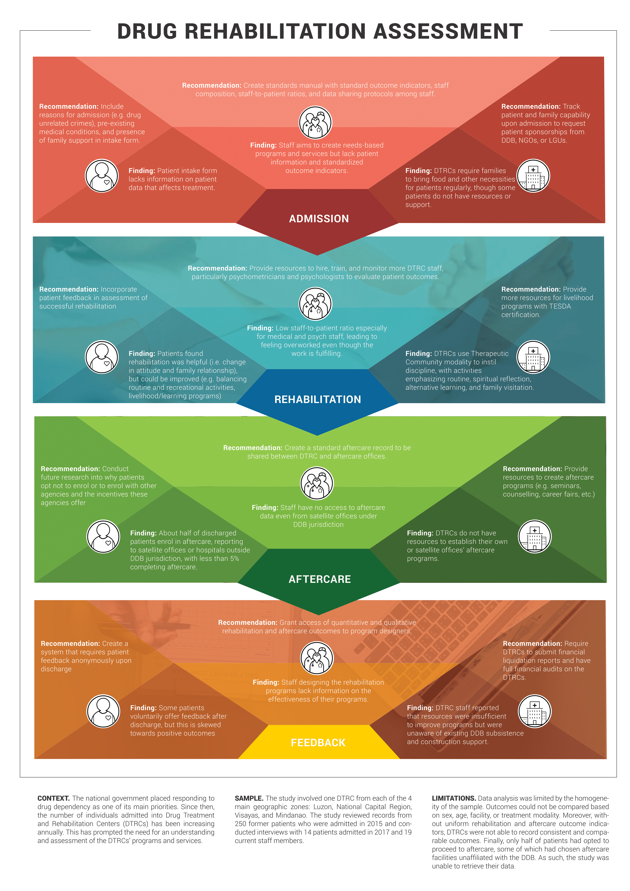

## A. Introduction

In response to the rising number of drug cases in the Philippines, one of the current administration's main goals is a more robust response to drugs and drug dependence. The use of harmful, and often illegal substances, is a public health problem given its impact on the patient’s overall welfare. However, with proper treatment and ample social support, the likelihood of recovery from dependency is high.
 
Drug Treatment and Rehabilitation Centers (DTRCs) serve as the primary institutions that provide treatments for drug dependents and some of these facilities are government-supported through the Dangerous Drugs Board and the LGUs. The facilities follow the Comprehensive Dangerous Drugs Act of 2002 which states the mandates for admission, treatment and rehabilitation, and aftercare.
 
In line with this, the study aims to assess the efficiency and effectiveness of selected DTRCs by examining specific outcomes and evaluating current systems in place. This entails reviewing programs and services and looking at the lives of patients post-rehabilitation and, ideally, aftercare. Apart from creating a comprehensive picture of the present situation of DTRCs, identifying gaps and issues in their systems presents an opportunity to provide recommendations for improvements to ensure better tailoring of services and provision for the needs of recovering patients.    	
 
## B. Methods

To determine if there was a significant difference in the outcomes observed between individuals who have completed both the required treatment and aftercare and of those who have not, a retrospective cohort study was used. In theory, completion of the whole program should merit better outcomes. Integral to the success of the program are the DTRC staff, and the proper allotment and use of sufficient resources. Thus, these elements were also assessed.

Taking into consideration the sensitivity of the information gathered and the study participants’ situation, measures were taken to ensure the quality of the tools used, the safety of the patients, and the security of the data collected while the study was performed. The following steps were done with all ethical considerations in mind:

### Target Population and Sampling Design
DTRC branch, and age (must not be a minor) were set as additional criteria, apart from the year of admission, to guide the stratified random selection of patients from 2015 admissions. A sample size of 250 was computed and used to determine the proportion of participants chosen for records review from each facility with the largest number of admissions from each of the geographic zones (Luzon, NCR, Visayas, and Mindanao). Six patients from the 2017 admissions along with five staff members were also selected each facility to participate in the interviews.

### Data Collection Plan
Primary and secondary data were accessed from Dangerous Drugs Board (DDB) and DTRC databases. These include patient background and information on facility funding. Key Informant Interviews were also used to collect assessments on the programs and operations of the selected facilities from the perspective of the staff and patients.

### Data Analysis Plan
The analysis was divided into qualitative and quantitative. KIIs were analyzed for content which were common to the responses and adhered to themes. Descriptive statistics were used on sociodemographic data and baseline characteristics collected. Pathway analysis was used to study the patient’s journey. Modifications in the study design were necessary to accommodate homogeneity of information and lack in some data.
 
## C. Results and Discussion

### Quantitative Results and Analysis 
Univariate quantitative analysis reveals that certain sociodemographic characteristics are linked to the development of or the absence of drug dependence and of consequent drug usage. Some factors may also affect patients’ outlook, particularly, relationships with family, while receiving treatment from the facilities. The impact of community and family relationships and patient’s religious background, among other pertinent background information gathered, justifies the use of the Therapeutic Community method for treatment modality. The data is also used to help tailor the design of the program and the treatments given. Finally, reports also revealed gaps in aftercare availment and completion of patients. Less than half of the sample size followed their treatment with aftercare and more than 75% that did attend did not even reach at least two months of the prescribed 6-8 months.
 
### Qualitative Results and Analysis
Patient and Staff KIIs were analysed and common themes were identified in the responses about their background, effectiveness of treatment and facilities, overall satisfaction, and suggestions. Patient KIIs, including answers of non-drug dependent plea bargain cases, reveal their routines, treatment received, and  relationships with families. These shed light on how patients acquired provisions during their stay in the facility, and their satisfaction with the services. Undergoing the treatment changed the initial perceptions of some dependents on the facility and of themselves. Their initial idea of a “jail-like” facility has transitioned into seeing it as “different”. The total average rating of 4.3 out of 5 shows the level of satisfaction of the patients with the services and some have expressed that their daily routine and treatment helped realign their views and motivate them to change their behavior.
 
Staff responses reveal cases of overwork and overload due to problems in human resources. However, the staff still expressed personal fulfillment and willingness to serve despite said problems. Anecdotal evidence also highlighted their witnessing of improvements of patients after their stay in the facility. Lack of information on sources of funding was common across facilities. Aftercare information and statistics and data on succeeding outcomes were evidently few or mostly absent from the records of the DTRCs. Comparative thematic analysis has shown consensus in main goals of staff and patients with regards to treatment, with additional expectations from the staff. The presence of non-drug dependent individuals have created a discrepancy since treatment and outcomes are not applicable to them.
 
### Pathway Analysis
Finally, Pathway Analysis encountered issues largely centered on only 6 patients (4.9% of sample). The retrospective approach intended to trace development starting with the outcome of completing aftercare, which only the six have achieved. Outcomes were difficult to track due to aftercare conditions, despite adjustments. Even with the exclusion of aftercare from the pathway, analysis was still hindered by limitations in available data. Tracing the pathway has revealed gaps and inconsistencies in patient records, aftercare data, funding for facilities and provision for patients, lack of supporting information for program and service design, and discrepancies in expected outcomes.      	
 
## D. Conclusions

Concerns existing in the DTRCs that affect their impact and performance can be traced to the issues in their current system with regards to admission, rehabilitation, aftercare, and feedback. Despite anecdotal evidence on improvements after treatment, the lack of information and follow-up on patients after their stay at the facilities, and mismatch in patients admitted (plea bargain cases), have hindered DTRCs from making more accurate evaluations of outcomes and effectiveness of the programs and services. This also affects program and service design due to the lack of evidence that can be used to innovate the measures implemented. There is also a pressing need to improve information dissemination on both patient and administrative affairs to the staff. Transparency in funding is also an issue, given the lack of resources and dependence on family support for subsistence of some patients. Human resources should also be boosted if fortifying programs and initiating change is to be achieved.
 
The study recommends improvements in the form of policy revisions, institutional action, and research efforts.
1. Refining the admission process to limit mismatch and make better considerations on the conditions of the patients prior to entry is called for, as well as tracing the outcomes for each patient after the treatment.
2. Uniform measures for DTRC administration, including provisions on aftercare, must also be formulated. This would entail bolstering communication channels between concerned institutions, and establishing accurate and comprehensive databases on patient information. Measures for transparency in finances and better resource allocation must also be prioritized.  
3. Finally, conducting research on patient responses to aftercare and facility conditions is necessary, and financial audits would also be helpful in making useful changes to the DTRC systems.

[Executive Summary](../assets/projects/kessel/EpiMetrics_EffectivenessDrugFaci_ExecSum.pdf){:target="blank"}
[Policy Brief](../assets/projects/kessel/EpiMetrics_EffectivenessDrugFacilities_PolicyBrief.pdf){:target="blank"}
[Infographic](../assets/projects/kessel/Kessel_Infog.png){:target="blank"}

**For more information on the study, email us at [contact@epimetrics.com.ph](mailto:contact@epimetrics.com.ph)**
