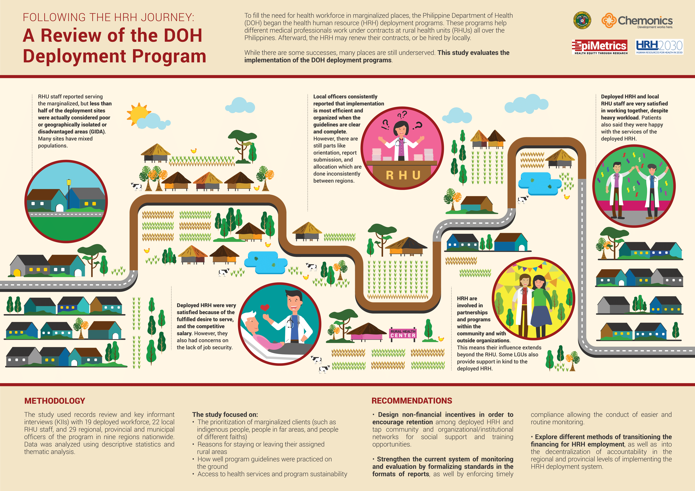

## A. Introduction

In order to address gaps in health workforce in marginalized areas, the Philippine Department of Health (DOH) initiated health human resource (HRH) deployment programs.  While there are some successes, many areas remain underserved. Studies are needed to evaluate the implementation of the DOH deployment programs and provide direction and recommendations for the further refinement of the programs. This study aimed to be a rapid assessment program review of the DOH deployment programs for four types of deployed personnel (doctors, nurses, medical technologists and midwives) in nine selected service-delivery networks located in nine regions.

## B. Methods

The review’s objectives focused on the following areas: the prioritization of marginalized clients, the distribution and retention of deployed workforce, training, change in access to health services and program sustainability.
 
The study employed a mixed methods study design, using both **records review** and **key informant interviews (KIIs)** with deployed workforce, organic staff, and local implementers of the program. Quantitative analysis included  descriptive statistics, while qualitative analysis employed thematic analysis. A total of 19 deployed HRH, 22 organic staff, and 29 local implementers from nine regions were interviewed.  

## C. Results and Discussion

Less than half of the sites were considered poor or geographically isolated or disadvantaged areas (GIDA) as per government classification; however organic staff and deployed HRH stated in interviews that they catered to marginalized patients within their regions.

Deployed HRH were highly satisfied, mainly due to their fulfilled desire to serve and competitive salary. However, the need for job security and other practical arrangements factored into their decision to leave their area of assignment.

Regarding implementation fidelity, local implementers consistently stated that implementation is most efficient and organized when the guidelines are clear and well understood; however, there are still parts of implementation such as orientation, report submission, and allocation which are inconsistent between regions.

HRH and organic staff reported high satisfaction in working with each other, and in working in the community, with their colleagues, facilities assigned, and patients; thus it can be said that there was high cultural acceptability between HRH and their assigned area. HRH are also generally accessible to their patients despite their workday being full.

Finally, HRH are involved in partnerships and programs in the community, and though sparse, there were environmental and organizational support from LGUs for HRH activities.

## D. Conclusions

Based on these, some recommendations for **policy** to consider are designing non-financial incentives in order to encourage retention among deployed HRH and, to address the longer-term factors of employment and environment that they consider in their decision to remain in their areas. Rich community, organizational and institutional networks may also be tapped for social support and training opportunities. Recruitment should also include prioritizing applicants from rural backgrounds. The program may also consider arrangements for applicants that are in the later stages of their career. With regards to recommendations for **action**, strengthening the current system of monitoring and evaluation by formalizing standards in the formats of reports, as well by enforcing timely compliance, may help LGUs implement HHRDB guidelines more uniformly and clearly. This would also allow HHRDB to conduct monitoring easier and at a more routine basis.

Finally, research recommendations include studies into different methods of transitioning the financing for HRH employment, and the effects of the decentralization of accountability in the Regional and Provincial levels of implementing the HRH deployment system.

[Executive Summary](../assets/projects/hrh/EpiMetrics_ReviewofDeployment_ExecSummv1.pdf){:target="_blank"}

[Policy Brief](../assets/projects/hrh/EpiMetrics_ReviewofDeployment_PB.pdf){:target="_blank"}

[Infographic](../assets/projects/hrh/HRH_19Nov2019-with_regular_font.pdf){:target="_blank"}

{: .size-large .align-center}

**For more information on the study, email us at [contact@epimetrics.com.ph](mailto:contact@epimetrics.com.ph)**