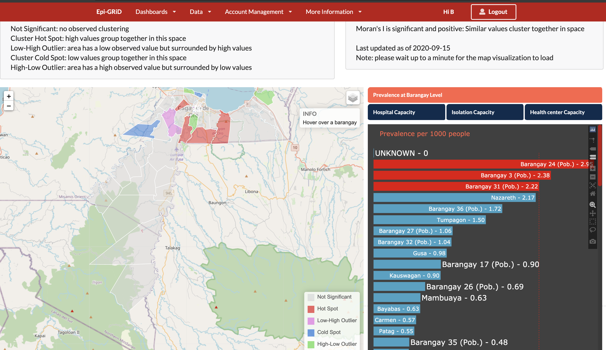
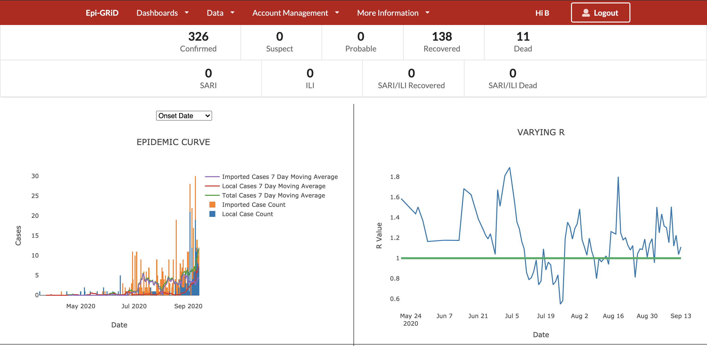

 
With the acuteness of the COVID-19 pandemic, local governments were placed in the difficult position of taking action with limited information. To support local officials in their decision-making and response actions, the National Resilience Council (NRC), in partnership with Ateneo de Manila University Coastal Cities at Risk Philippines (CCARPH), created the Geospatial Risk Dashboard project with their implementing partners - Xavier University (XU) and EpiMetrics, Inc. A series of workshops and consultations were done to achieve the goals of this project.

The thrust of this project was to enable partner local government units (LGUs) to create their own web-based dashboards for COVID-19, providing a basis for making evidence-based decisions and policies. The role of EpiMetrics was to create a web-based application to produce an epidemiologic layer for the LGU dashboards. The application was developed through the Agile Framework, wherein application features are developed and released in phases with feedback from the users being obtained at every step. 

This online application allows LGUs to input case data and healthcare (facilities, testing, and health worker) capacity. The application generates graphs for the epidemic curve, reproductive number, doubling times, and positivity rates over time. It also generates choropleth maps to demonstrate the barangays’ active case counts. To add significance to this data, the application utilized Local Indicators of Spatial Association (LISA) to identify cluster hotspots.  All generated graphs and maps are downloadable and easily incorporated to the main LGU COVID-19 dashboards. Additional resources and guidelines are also incorporated in the application site. Since its delivery, the application has aided local committees in presenting their data to the local chief executives for monitoring and planning actions. 

{: .size-large .align-center}
{: .size-large .align-center}

_Sample images of the dashboard taken using dummy data. Map was pixelated to hide actual locations, but actual dashboard will be clear using Google Maps._

You can also read more about the full Web-based Geospatial Risk Database for COVID-19 Pandemic Response and Recovery (Web-GRID) Project on the National Resilience Council website, [here](../assets/projects/holomap/ProjSum_WebGRID.pdf){:target="_blank"}.  

**For more information on the study, email us at [contact@epimetrics.com.ph](mailto:contact@epimetrics.com.ph)**