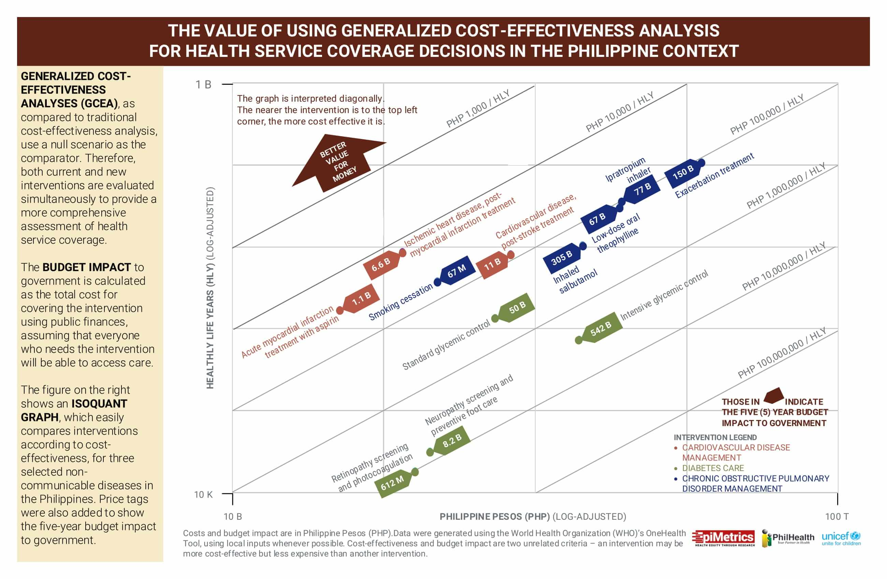
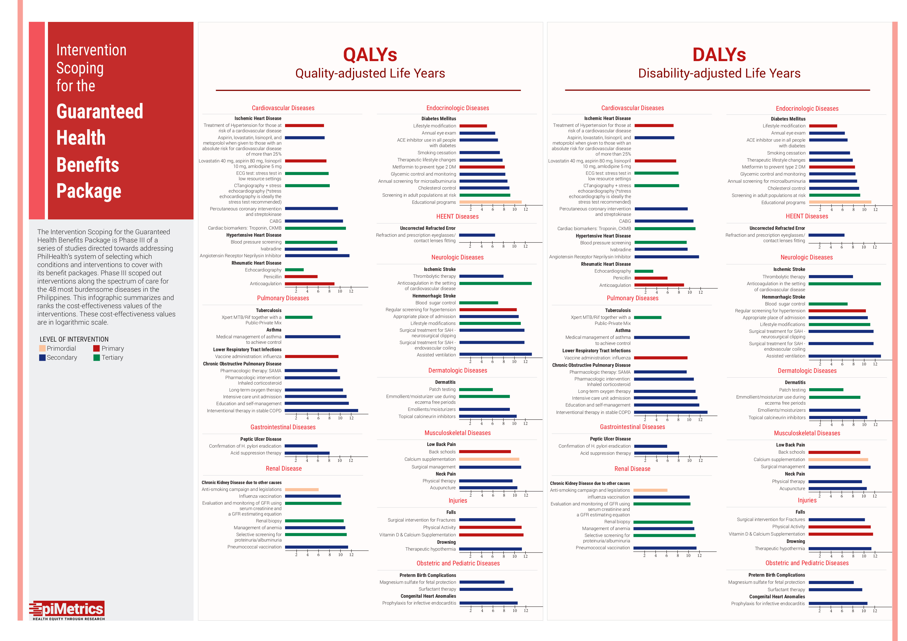

Achieving universal health care remains a relevant theme in the Philippines' health agenda. As PhilHealth continues to expand its coverage and scope of benefit packages, it needs a transparent and systematic method of prioritization that will optimize resource allocation for competing health needs. This **four-phase study** aims to provide our national policymakers with evidence-based information to guide the decision-making process of developing benefit packages in order to ensure financial risk protection, continuity, and quality of care for all Filipinos.

**Phase I** projects the Philippines’ burden of disease profile from 2015-2035, based on the 2013 Global Burden of Disease (GBD) database, as well as the age and sex structure of the population. From the list, the most burdensome diseases and their recommended interventions are determined. It was found that 48 conditions contribute to 80% of the total burden of disease of the Philippines during this time period, half of which is attributed to the top 10. As such, it is recommended that the Department of Health (DOH) and PhilHealth address the 48 most burdensome diseases (accounting for 80% of total 20-year burden of disease) by creating Guaranteed Health Benefits Package (GHBP) to provide financial risk protection for cost-effective health interventions. Full details of the study have been published in the peer-reviewed publication Health Systems and Reform: [Priority Setting for Health Service Coverage Decisions Supported by Public Spending: Experience from the Philippines](http://www.tandfonline.com/doi/full/10.1080/23288604.2017.1368432)  

[Phase I: Executive Summary](../assets/projects/a-series/EpiMetrics_GHBPPhaseI_ExecSumm.pdf){:target="_blank"}

This data is fed into **Phase II** of the study, which aims to develop a formal priority setting process. A literature review followed by a series of consultations were conducted to synthesize the best practices and health system models of Thailand, Australia, and UK, and determine which are applicable to our country’s context. This generated a seven-step priority setting process from nomination to approval, complemented by a set of 4 criteria points that will facilitate the assessment of new interventions for PhilHealth coverage. It is anticipated that these, alongside 7 accountability-based principles, will increase transparency and stakeholder participation necessary to achieve the country’s health system goals. 

Phase II also tested the feasibility of the World Health Organization’s (WHO) OneHealth Tool to conduct generalized cost-effectiveness analyses (GCEA) and budget impact analysis (BIA) for all interventions that may be considered under the GHBP. Our reflections have been published in the peer-reviewed publication F1000R: [Reflections on the use of the World Health Organization’s (WHO) OneHealth Tool: Implications for health planning in low and middle income countries (LMICs)](https://f1000research.com/articles/7-157/v2) 

[Phase II: Executive Summary](../assets/projects/a-series/EpiMetrics_GHBPPhaseII_ExecSumm.pdf){:target="_blank"}

[Phase II: Infographic](../assets/projects/a-series/top-48-CEA.jpg){:target="_blank"}

{:style="max-width: calc(100% - 20px);"}

Using the data and processes obtained from the first two phases, **Phase III** narrowed down the cost-effective interventions along various life stages and levels of prevention for the 48 most burdensome diseases for possible inclusion in the GHBP. This was done through literature review of international standards of care and local clinical practice guidelines (CPGs), consultations with experts from the various disciplines, and conducting cost-effective analysis and budget impact analysis. Results showed that primary preventive interventions were found to be the cheapest ($10 to $441 per DALY averted) for most of the life stages, suggesting potential targets for prioritization for the DOH and PhilHealth.

[Phase III: Executive Summary](../assets/projects/a-series/EpiMetrics_GHBPPhaseIII_ExecSumm.pdf){:target="_blank"}

[Phase III: Policy Brief](../assets/projects/a-series/GHBP_PolicyBrief.pdf){:target="_blank"}

[Phase III: Infographic](../assets/projects/a-series/EpiMetrics_Intervention%20Scoping_Infographic.jpg){:target="_blank"}

{:style="max-width: calc(100% - 20px);"}

**Phase IV** aimed to identify whether these potential interventions are feasible in the local context, in terms of resource items, unit costs, and their respective resource volumes. Results of the study provided an estimate cost of managing the 48 most burdensome diseases in the Philippines. More importantly, it suggests a methodology (top down or cost per bed day approach) that government administrators can adopt to guide and standardize planning and implementing future rate setting and payment mechanisms.

[Phase IV: Executive Summary](../assets/projects/a-series/EpiMetrics_GHBPPhaseIV_ExecSumm.pdf){:target="_blank"}

[Phase IV: Policy Brief](../assets/projects/a-series/Policy%20Brief%20IV.pdf){:target="_blank"}

[Phase IV: Infographic](../assets/projects/a-series/Infographic%20IV.jpg){:target="_blank"}

{:style="max-width: calc(100% - 20px);"}

**For more information on the study, email us at [contact@epimetrics.com.ph](mailto:contact@epimetrics.com.ph)**
