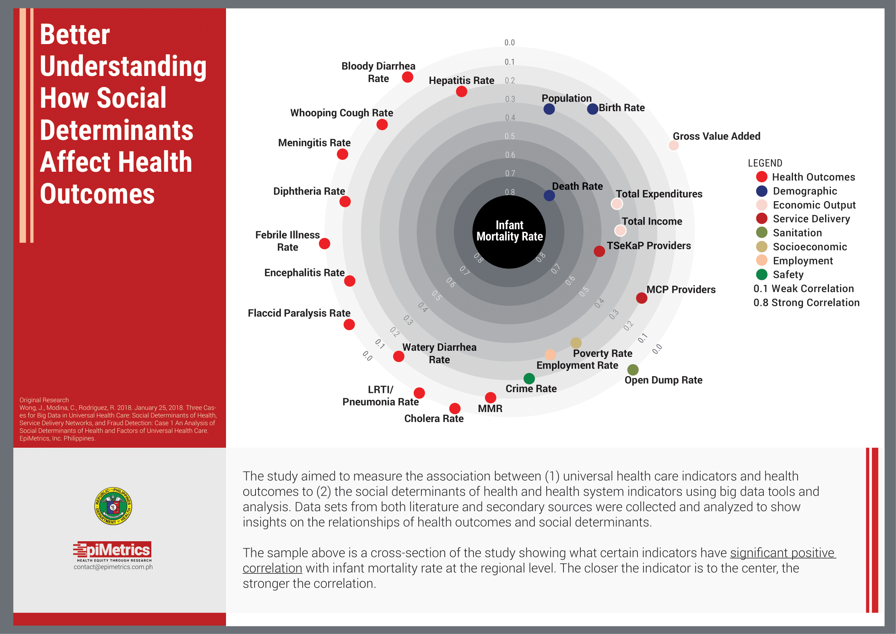
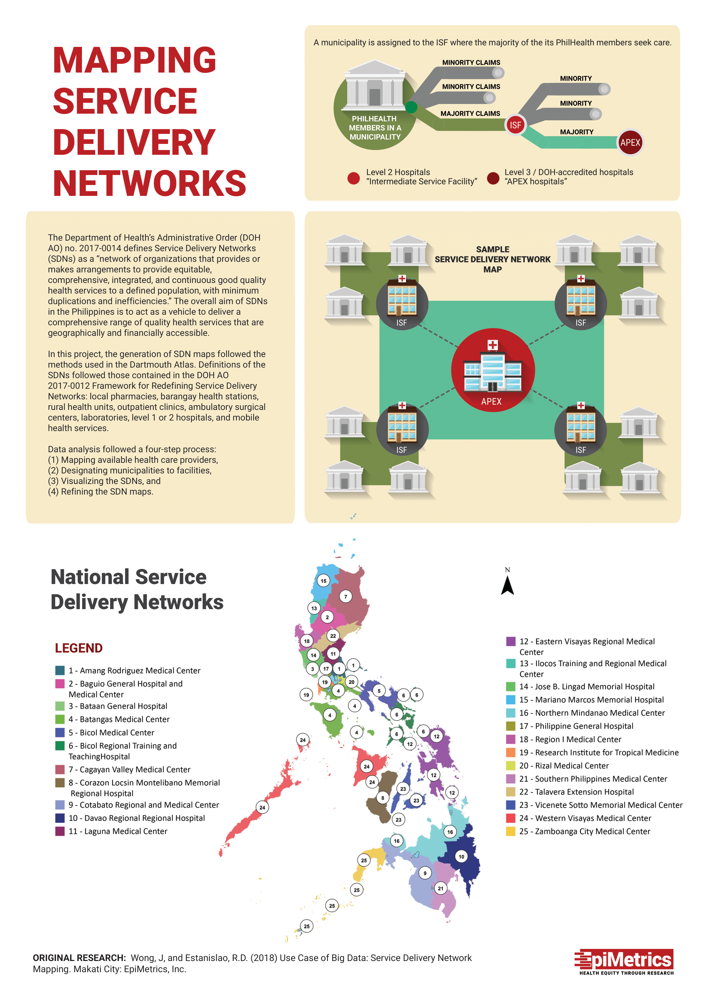
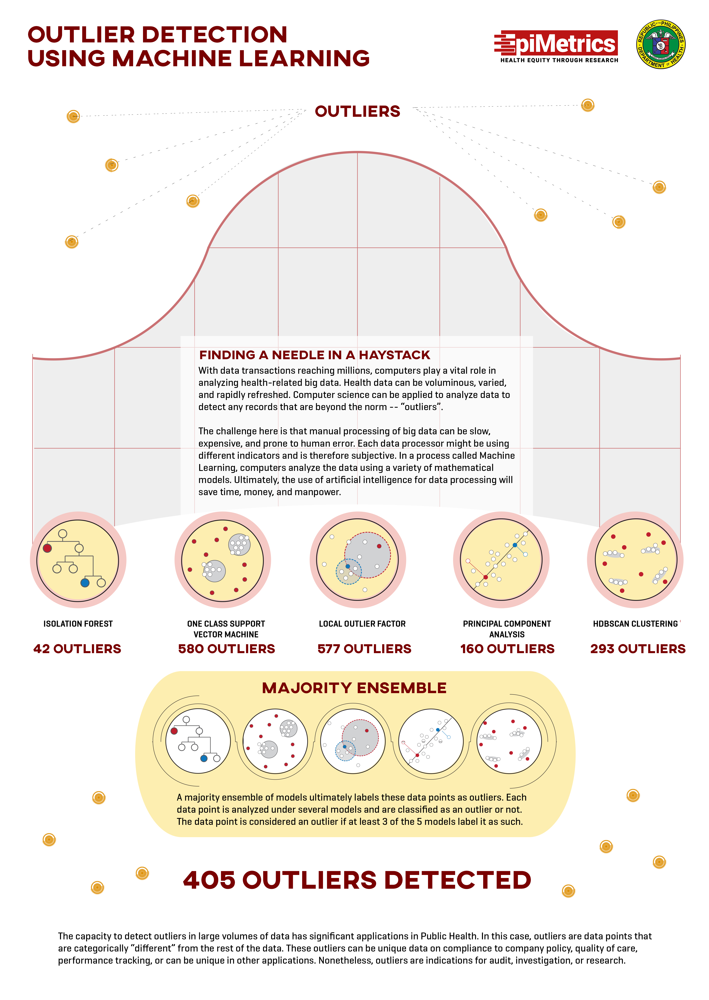

Government agencies, specifically, the Department of Health (DOH) and the Philippine Health Insurance Corporation (PhilHealth) have been amassing data about the nation’s health, universal health  care, and on the social determinants of health (SDH). To assist the Department of Health (DOH) and the Philippine Health Insurance Corporation (PhilHealth) in the achievement of national and global health goals for sustainable development, this project used big data tools to maximize the generation of actionable information from the amassed data.

The project applied big data methods in three topics highly relevant to the DOH. 

## The First Case

The **first case** quantified the contribution of significant SDH factors to disease and health inequities in the Philippines. The analysis of provincial health outcomes resulted with a total of 181 significant correlations: 85 Health System Indicators and 96 Social Determinants of Health. As for regional health outcomes, there was a total of 173 significant correlations: 22 Health System Indicators and 151 Social Determinants of Health. The unavailability of viable data led to a change in the intended outputs;instead of an interactive dashboard with a data feed, static visualizations were made.

[Case 1: Executive Summary](../assets/projects/big-data/EpiMetrics_C1SocialDeterminants_ExecSumm.pdf){:target="_blank"}

[Case 1: Policy Brief](../assets/projects/big-data/EpiMetrics_C1SocialDeterminants_PolicyBrief_022018.pdf){:target="_blank"}

[Case 1: Infographic](../assets/projects/big-data/EpiMetrics_C1SocialDeterminants_Infographic_062018-1.png){:target="_blank"}

## The Second Case

The **second case** used geospatial software for the DOH that can visualize and analyze performance for indicators at the LGU-level for service delivery networks (SDN), DOH programs and departments, SDH and health inequities, and LGU health statistics. A total of 25 different SDNs were identified and mapped. The majority of the SDNs were in the island of Luzon. SDNs in the Visayas region roughly correspond to the current regional administrative divisions. Mindanao was divided into 5 sections, approximating the current regional administrative divisions.

[Case 2: Executive Summary](../assets/projects/big-data/EpiMetrics_C2SDN_ExecSumm.pdf){:target="_blank"}

[Case 2: Policy Brief](../assets/projects/big-data/EpiMetrics_C2ServiceDeliveryNetworks_PolicyBrief_022018.pdf){:target="_blank"}

[Case 2: Infographic](../assets/projects/big-data/EpiMetrics_C2SDNDevelopment_Infographic_062018.pdf){:target="_blank"}

## The Third Case

Finally, the **third case** was for PhilHealth outlier detection for insurance claims together with Thinking Machines. Analysis was conducted according to claims groups namely, Cataract, Moderate Risk Pneumonia and High Risk Pneumonia. Five models were included into the analysis which allowed for an unsupervised machine learning, which focused on outlier detection. Outlier status derived from each model is then entered into a majority ensemble, such that if 3 out of 5 models classifies a claim as an outlier, it is considered an outlier overall. By undergoing a majority ensemble of 5 unsupervised machine learning models, outliers were detected. Due to the lack of training data, it was not possible to undergo a supervised type of machine learning. As such, it is likely that these outliers should undergo an audit, in order to determine if they are truly fraudulent or not.

[Case 3: Executive Summary](../assets/projects/big-data/EpiMetrics_C3OutlierDetection_ExecSumm.pdf){:target="_blank"}

[Case 3: Policy Brief](../assets/projects/big-data/EpiMetrics_C3OutlierDetection_PolicyBrief_022018.pdf){:target="_blank"}

[Case 3: Infographic](../assets/projects/big-data/EpiMetrics_C3OutlierDetection_Infographic_022018.png){:target="_blank"}

Since the application of big data in the Philippine setting is an emerging field, this project was a proof of concept for the DOH and PhilHealth to explore the field for important tools in the monitoring and evaluation of public health. With big data, analysis of diverse and voluminous data becomes possible, and the DOH can gain insight into the factors that significantly impact and influence the health of the nation. However, mechanisms and policies must be put in place to ensure that data is available, accessible, and of good quality in order to properly apply big data analytics.

**For more information on the study, email us at [contact@epimetrics.com.ph](mailto:contact@epimetrics.com.ph)**